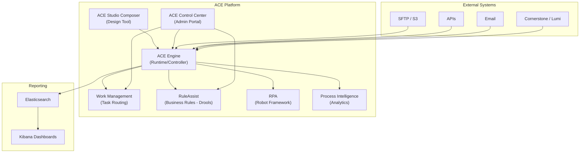
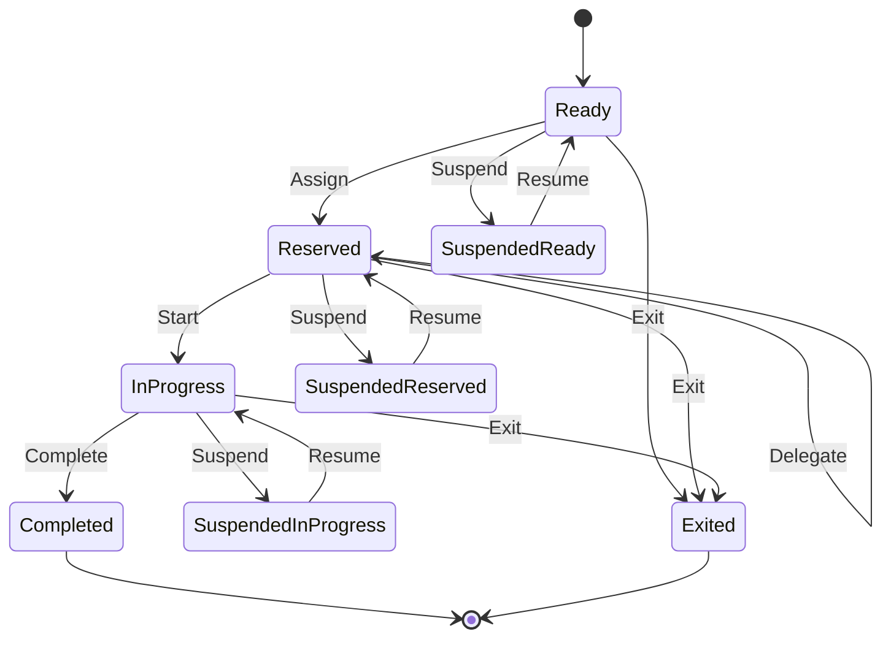
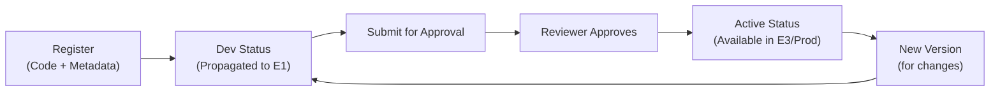
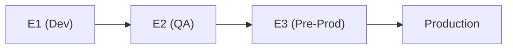

# 📘 ACE Core — Comprehensive Knowledge Document

> **Source:** Synthesized from ACE Bootcamp (Day 1–5), ACE Platform Overview, Automation Strategy, Mod Shop Overview, and 15+ project meetings (Jan–Jul 2026).

---

## 1. What is ACE?

**ACE (Automation and Case Ecosystem)**, also known as **ACE Studio**, is a foundational enterprise platform for:

- **Business workflow automation** (process management)
- **Semi-predictable business case management** (case management)
- **Robotic process automation** (RPA)
- **Business rule execution** (RuleAssist)
- **Process intelligence** (analytics)
- **Work management** (human task routing)

ACE is built on **open-source libraries** so teams don't require specialized proprietary tool training. It replaces the legacy **Blue Prism / QOD** platform.

---

## 2. Platform Architecture



### 2.1 ACE Engine
The **core runtime/controller** that:
- Takes designed workflows (BPMN/CMMN) and automates execution
- Drives step-by-step process automation
- Interprets design-time decisions
- Routes work to humans or bots
- Orchestrates service tasks, user tasks, and RPA tasks

### 2.2 ACE Studio Composer
The **design tool** (web-based UI) for:
- Creating BPMN process diagrams
- Creating CMMN case models
- Defining inputs/outputs for each task
- Configuring work baskets and task assignments
- Setting up schedulers for process execution
- Developing RPA scripts (Robot Framework)
- Managing a **service catalog** of reusable tasks
- Publishing models to assets for cross-team reuse

### 2.3 ACE Control Center (Admin Portal)
The **admin portal** for:

| Section | Purpose |
|---|---|
| **Process/Case Search** | Filter instances by dates, status, process ID, correlation key |
| **Work Management** | Manage work baskets, allocate tasks, filter by lifecycle state |
| **RuleAssist** | View deployed rules, usage metrics, audit logs |
| **Scheduling** | Configure/review scheduled processes |
| **Bulk Processing** | Define bulk policies for batch dataset execution |
| **Security** | Manage access controls for triggering, creating, and picking up work |
| **Process Intelligence** | Insights dashboards for bottleneck detection |

---

## 3. Automation Modalities

### 3.1 Process Management (BPMN)
- **Standard:** Industry-standard Business Process Model and Notation (BPMN)
- **Use Case:** Repeatable, predictable, sequential workflows
- **Characteristics:** Directed flow, step-by-step, fully automatable
- **Example:** Monthly payment processing — get payment details → RPA processes payment → validate status → gateway decision → end or manual fallback

### 3.2 Case Management (CMMN)
- **Standard:** Case Management Model and Notation (CMMN)
- **Use Case:** Semi-predictable, non-linear, data-driven workflows
- **Characteristics:** Event-driven, long-running (30/60/90 days), parallel activities, human-centric
- **Example:** Credit line application — collect details → sentries evaluate conditions → approve or reject → create account → communicate to customer

#### ACE Caselight
- **Low-code/no-code** solution for simple case types
- Designed for rapid onboarding
- Best for: manual servicing requests, fail-fast product launches

### 3.3 RPA (Robotic Process Automation)
- **Language:** Robot Framework
- **Capabilities:** Web browser automation, mainframe screens, desktop applications
- **Integration:** RPA scripts are registered in ACE service catalog and referenced in BPMN flows
- **Example:** Bot navigates to payment portal and completes payment automatically

### 3.4 RuleAssist (Business Rules)
- **Engine:** Drools
- **Supported formats:**
  - Drools native language
  - Decision tables (Excel)
  - Domain-specific languages
- **Features:**
  - Rules can be updated without interrupting running processes
  - Usage tracking and audit trails
  - Standalone or embedded in BPMN/CMMN flows
- **Example:** Reject credit card application if applicant age < 18

### 3.5 Process Intelligence
- Automatic acquisition of process event data
- Discovers patterns, identifies bottlenecks, measures throughput
- Provides optimization recommendations
- Tracks: work distribution, completion times, work items per user

---

## 4. Work Management

### 4.1 Task Lifecycle (OASIS Standard)
ACE follows the **OASIS Human Task Lifecycle** with these states:



| State | Meaning |
|---|---|
| **Ready** | Task in work basket, available for pickup |
| **Reserved** | Assigned to a specific worker |
| **In Progress** | Worker has started the task |
| **Suspended** | Task on hold (can resume to previous state) |
| **Completed** | Task finished successfully |
| **Exited** | Task cancelled — not required anymore |

> **Note:** States not used: Created, Failed, Error, Obsolete

### 4.2 Work Baskets
- Group and queue tasks for specific teams/workers
- Workers can: update status, suspend, complete, delegate, or exit tasks
- Admins can: allocate tasks, filter by state, view across deployments
- SLA enforcement via timer boundary events — breached SLA can release assigned user and return task to work basket

### 4.3 SLA Handling
- **Timer boundary events** on user tasks enforce SLAs
- On SLA breach: task can be released from assigned user → returned to Ready state in work basket → available for reassignment
- Can also trigger reminder emails (1st, 2nd, 3rd) or escalation flows

---

## 5. Ways to Start a Process

| Trigger Type | Description |
|---|---|
| **API** | External systems call ACE APIs to start a process |
| **UI** | Web UI actions trigger processes |
| **Event Ingestion** | Listeners subscribe to external events (SFTP file arrival, email bounce, inventory change) |
| **Bulk Processing** | Upload Excel/CSV/flat files → ACE triggers process per row |
| **Scheduled Jobs** | On-demand, one-time, recurring (date/duration/cycle/cron) |

### 5.1 Scheduling Options

| Type | Description | Example |
|---|---|---|
| **Date** | Specific datetime | "Run at 2026-03-15 09:00 EST" |
| **Duration** | Delay-based start | "Start after 5 minutes" |
| **Cycle** | Repeat with frequency | "Every 1 hour, max 10 repetitions" |
| **Cron** | Standard cron expression | "0 0 1 * *" (1st of every month) |

### 5.2 Bulk Processing
- Supports: Excel, CSV, flat/mainframe files
- Header validation (field names/order)
- Configurable delimiters (e.g., semicolon for EU markets)
- **Transformation policies** map file columns to process input fields
- Files can be processed immediately or scheduled
- PII columns: platform performs whole-file and field-level encryption per EDPP

### 5.3 Process Chaining
- One process can start another using a **process task**
- **Sync** (default): Wait for downstream process to complete
- **Async**: Fire-and-forget, don't wait

---

## 6. Error Handling Patterns

### 6.1 Exception Types

| Type | Description | Handling |
|---|---|---|
| **Business Exception** | Expected business scenario (e.g., account already closed) | Route to business path — notify ops, log work item |
| **System Exception** | Infrastructure failure (e.g., API down) | Log, surface to SRE, retry with backoff |

### 6.2 Error Boundary Events
- Attach to service tasks to catch specific errors
- Configure with error code/name
- Multiple boundaries per task → different error types → different recovery flows
- **Common patterns:**
  - Retry with timer (exponential/fixed backoff)
  - Route to human task for manual resolution
  - Escalate with notification email
  - Create work item in ops queue

### 6.3 Standardization Requirements
- Error naming conventions must be standardized across all BPMN flows
- Enables consistent scorecards: business exceptions %, automation success rates
- Leadership can track trends across the entire automation portfolio

---

## 7. Deployment & Naming Conventions

### 7.1 Deployment IDs
- A **logical name** grouping automations by infrastructure
- Determined by: volume, geography, regulatory needs, integrations
- Effectively **permanent** for the automation's lifetime
- Can be scaled or split across multiple deployments for high-volume cases

### 7.2 Naming Standard
```
ACES_<BusinessFunctionality>_<major>.<minor>.<patch>
```

| Component | Rule |
|---|---|
| **Prefix** | `ACES` for internal automation |
| **Name** | Business process/use case name |
| **Version** | Semantic versioning (major.minor.patch) |
| **Major** | Breaking changes |
| **Minor** | Non-breaking enhancements |
| **Patch** | Bug fixes |

For external teams: prepend their central asset ID to the use case name.

---

## 8. Mod Shop

**Mod Shop** is a portal for creating and registering reusable components ("mods"):

### 8.1 Mod Types

| Type | Purpose | Example |
|---|---|---|
| **Task** | Update/write operations | Update customer address |
| **Data Provider** | Read operations | Fetch card details |
| **Process** | Stitched multi-step workflow | Combined data fetch + update + notification |

### 8.2 Lifecycle



### 8.3 Key Features
- **Registration:** Code name, version, description, BU/market, repo link, Group/Artifact ID
- **Execution config:** Retry counts, retry intervals, failure behavior (escalate/email)
- **Input/Output CRD:** Labels, data types (string, number, boolean, date, map, object, list)
- **Execution modes:** Single (UI) or Bulk (file upload with validation)
- **Runtime:** Java (Python planned for future)
- **Tenancy:** Multiple tenancies now supported; Direct Execution Tenancy for bot deployments
- **Versioning:** Active mods require new version for changes; Tech Admin can adjust flags during onboarding

---

## 9. Security & Governance

| Aspect | Details |
|---|---|
| **EDPP Compliance** | Enterprise Data Protection & Privacy guidelines followed |
| **Encryption** | Whole-file + field-level encryption for PII |
| **Access Control** | Deployment-level isolation; who can trigger/create/pick up work |
| **Operational Ownership** | Failing component's system team owns remediation; ACE provides logs for RCA |
| **Secrets** | Stored in Vault; never passed via plaintext; shared via secure channels only |

---

## 10. Reporting & Analytics

### Current State (Transition)
| From | To |
|---|---|
| Cornerstone → Tableau (delayed, batch) | Elasticsearch → Kibana (near real-time, self-service) |

### Standardization Needs
- Error codes and names must be standardized across all BPMN flows
- Enables consistent scorecards: business exceptions %, automation success rates
- Allows leadership to see trends across the portfolio
- **Key contacts for reporting:** Jason, Abby, Jay

---

## 11. How the Project Uses ACE

### 11.1 DQ Rule Onboarding (BPMN)
- Business submits rule request → ACE BPMN workflow routes through approval → automation generates SQL → deploys via Airflow DAG
- Self-serve UI writes to DQ_repository → BPMN processes pending entries

### 11.2 Alert Management (Work Baskets)
- DQ alerts are created as human tasks in work baskets
- Analysts reserve, investigate, classify (TP/FP), and complete tasks
- Bulk update feature: upload Excel → BPMN processes each row → updates task status

### 11.3 ACDV Dispute Processing (BPMN + RPA)
- Complex multi-step ACDV workflow with eligibility checks, data retrieval from multiple SORs
- RPA retrieves account status, plastic history, delinquency data
- Business exceptions for edge cases (sold accounts, bankruptcy)

---

## 12. Environment Promotion



| Environment | Purpose |
|---|---|
| **E1** | Development and initial testing |
| **E2** | Validation (required before E3 RFC) |
| **E3** | Pre-production; RFC required for deployment |
| **Prod** | Live; requires formal sign-off from product owner |

---

## 13. Quick Reference Card

| Item | Value |
|---|---|
| **Platform** | ACE (Automation and Case Ecosystem) |
| **Replaces** | Blue Prism / QOD |
| **Process Standard** | BPMN |
| **Case Standard** | CMMN |
| **RPA Language** | Robot Framework |
| **Rules Engine** | Drools (RuleAssist) |
| **Condition Language** | MVEL |
| **Design Tool** | ACE Studio Composer |
| **Admin Portal** | ACE Control Center |
| **Reporting** | Elasticsearch + Kibana |
| **Legacy Reporting** | Cornerstone → Tableau |
| **Reusable Assets** | 228+ reusable tasks in catalog |
| **Naming** | ACES\_\<function\>\_\<version\> |
| **Supported Runtimes** | Java (Python planned) |
| **Integrations** | RTF, ECM, ELF, PI |
