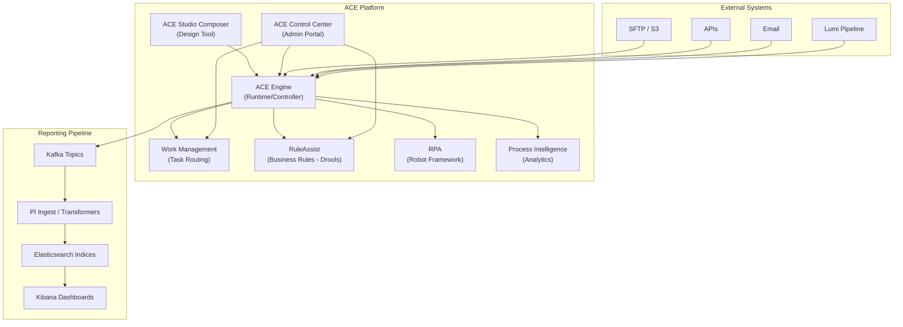
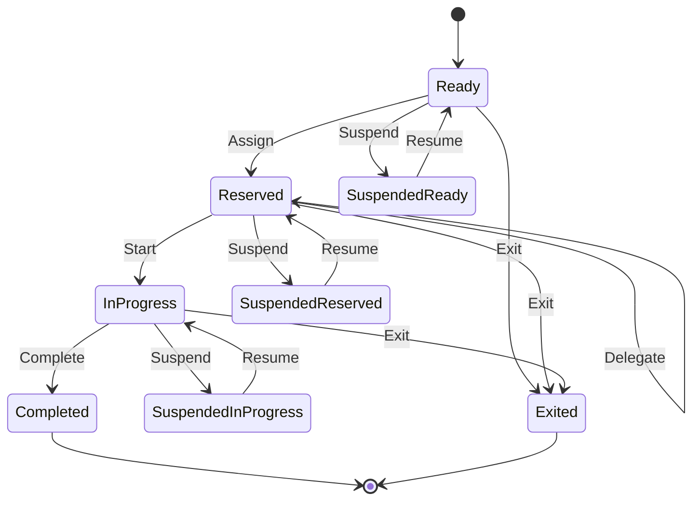
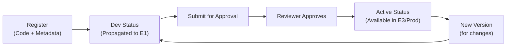
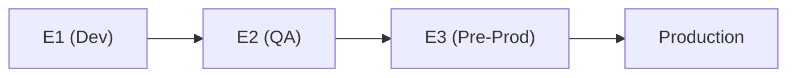

# 📘 ACE Core — Comprehensive Knowledge Document

> **Source:** Synthesized from ACE Bootcamp (Day 1–5), ACE Platform Overview, Automation Strategy, Mod Shop Overview, and 20+ project meetings (Jan–Jul 2026).

---

## 1. What is ACE?

**ACE (Automation and Case Ecosystem)**, also known as **ACE Studio**, is a foundational enterprise platform for:

- **Business workflow automation** (process management)
- **Semi-predictable business case management** (case management)
- **Robotic process automation** (RPA)
- **Business rule execution** (RuleAssist)
- **Process intelligence** (analytics)
- **Work management** (human task routing)

ACE is built on **open-source libraries** so teams don't require specialized proprietary tool training. It replaces the legacy **Blue Prism / QOD** platform.

---

## 2. Platform Architecture & Reporting Pipeline



### 2.1 ACE Engine
The **core runtime/controller** that:
- Takes designed workflows (BPMN/CMMN) and automates execution.
- Drives step-by-step process automation.
- Interprets design-time decisions.
- Routes work to humans or bots.
- Orchestrates service tasks, user tasks, and RPA tasks.

### 2.2 ACE Studio Composer
The **design tool** (web-based UI) for:
- Creating BPMN process diagrams and CMMN case models.
- Defining inputs/outputs for each task.
- Configuring work baskets and task assignments.
- Setting up schedulers for process execution.
- Developing RPA scripts (Robot Framework).
- Managing a **service catalog** of reusable tasks.
- Publishing models to assets for cross-team reuse.

### 2.3 ACE Control Center (Admin Portal)
The **admin portal** for:

| Section | Purpose |
|---|---|
| **Process/Case Search** | Filter instances by dates, status, process ID, correlation key. |
| **Work Management** | Manage work baskets, allocate tasks, filter by lifecycle state. |
| **RuleAssist** | View deployed rules, usage metrics, audit logs. |
| **Scheduling** | Configure/review scheduled processes. |
| **Bulk Processing** | Define bulk policies for batch dataset execution. |
| **Security** | Manage access controls for triggering, creating, and picking up work. |
| **Process Intelligence** | Insights dashboards for bottleneck detection. |

### 2.4 PI Reporting Ingestion Flow

When a tenant develops a use case on ACE, reporting is set up to capture runtime metrics:
1. **Kafka-based Eventing:** Running processes emit events to configured Kafka topics.
2. **Onboarding Configurations:**
   - **PI Registry:** Needs a `registry.json` file defining the index name, ES index name, application ID (CAR ID), application name, source, and deployment IDs. A UUID deployment ID uniquely identifies a use case.
   - **PI Event Ingest:** Emits events to Kafka, matching the topic configurations. Ingestion utilizes **transformers** and `mapping.js` configurations to convert the payload to JSON format.
   - **PI Egress:** Handles data export from the Elasticsearch database.
3. **Parent/Child Indexes:** When the `viewEnabled` flag is true in `registry.json`, a parent index stores records for multiple deployment IDs, and separate child indexes are automatically generated per deployment ID.
4. **Elasticsearch Index Templates:** Define pattern-matching rules, alias names (routing writes/reads), shard configurations (guidance of ~30GB per shard), and replica settings.

---

## 3. Automation Modalities

### 3.1 Process Management (BPMN)
- **Standard:** Industry-standard Business Process Model and Notation (BPMN).
- **Use Case:** Repeatable, predictable, sequential workflows.
- **Characteristics:** Directed flow, step-by-step, fully automatable.
- **Example:** Monthly payment processing — get payment details → RPA processes payment → validate status → gateway decision → end or manual fallback.

### 3.2 Case Management (CMMN)
- **Standard:** Case Management Model and Notation (CMMN).
- **Use Case:** Semi-predictable, non-linear, data-driven workflows.
- **Characteristics:** Event-driven, long-running (30/60/90 days), parallel activities, human-centric.
- **Example:** Credit line application — collect details → sentries evaluate conditions → approve or reject → create account → communicate to customer.

#### ACE Caselight
- **Low-code/no-code** solution for simple case types.
- Designed for rapid onboarding.
- Best for: manual servicing requests, fail-fast product launches.

### 3.3 RPA (Robotic Process Automation)
- **Language:** Robot Framework.
- **Capabilities:** Web browser automation, mainframe screens, desktop applications.
- **Integration:** RPA scripts are registered in the ACE service catalog and referenced in BPMN flows. Core automation triggers RPA asynchronously.
- **Example:** Bot navigates to payment portal and completes payment automatically.

### 3.4 RuleAssist (Business Rules)
- **Engine:** Drools.
- **Supported formats:**
  - Drools native language
  - Decision tables (Excel)
  - Compiled DLL files
- **Features:**
  - Rules can be updated without interrupting running processes.
  - Rule execution visibility: view which rules executed, coverage percentage (e.g., 100%), frequency, and exact inputs/outputs.
  - Standalone or embedded in BPMN/CMMN flows.

### 3.5 Process Intelligence
- Automatic acquisition of process event data.
- Discovers patterns, identifies bottlenecks, measures throughput.
- Variant path analysis: analyzes which execution paths occurred and their frequency.

---

## 4. Work Management

### 4.1 Task Lifecycle (OASIS Standard)
ACE follows the **OASIS Human Task Lifecycle** with these states:



| State | Meaning |
|---|---|
| **Ready** | Task in work basket, available for pickup. |
| **Reserved** | Assigned to a specific worker. |
| **In Progress** | Worker has started the task. |
| **Suspended** | Task on hold (can resume to previous state). |
| **Completed** | Task finished successfully. |
| **Exited** | Task cancelled — not required anymore. |

> **Note:** States not used: Created, Failed, Error, Obsolete.

### 4.2 Work Baskets
- Group and queue tasks for specific teams/workers.
- Workers can: update status, suspend, complete, delegate, or exit tasks.
- SLA enforcement via timer boundary events — breached SLA can release assigned user and return task to the work basket.

### 4.3 SLA Handling
- **Timer boundary events** on user tasks enforce SLAs.
- On SLA breach: task can be released from assigned user → returned to Ready state in work basket → available for reassignment.
- Can also trigger reminder emails (1st, 2nd, 3rd) or escalation flows.

---

## 5. Ways to Start a Process

| Trigger Type | Description |
|---|---|
| **API** | External systems call ACE APIs to start a process. |
| **UI** | Web UI actions trigger processes. |
| **Event Ingestion** | Listeners subscribe to external events (SFTP file arrival, email bounce, inventory change). |
| **Bulk Processing** | Upload Excel/CSV/flat files → ACE triggers process per row. |
| **Scheduled Jobs** | On-demand, one-time, recurring (date/duration/cycle/cron). |

### 5.1 Scheduling Options

| Type | Description | Example |
|---|---|---|
| **Date** | Specific datetime | "Run at 2026-03-15 09:00 EST" |
| **Duration** | Delay-based start | "Start after 5 minutes" |
| **Cycle** | Repeat with frequency | "Every 1 hour, max 10 repetitions" |
| **Cron** | Standard cron expression | "0 0 1 * *" (1st of every month) |

### 5.2 Bulk Processing
- Supports: Excel, CSV, flat/mainframe files.
- Header validation (field names/order) and skip lines config.
- Configurable delimiters (e.g., semicolon for EU markets).
- File retention duration: temporary storage defaults to 30 days.
- **Transformation policies** map file columns to process input fields.
- Concurrency control: configure execution policy (immediate vs. delayed) and thread count for subprocess runs.
- PII columns: platform performs whole-file and field-level encryption per EDPP.

---

## 6. Error Handling Patterns

### 6.1 Exception Types

| Type | Description | Handling |
|---|---|---|
| **Business Exception** | Expected business scenario (e.g., account already closed). | Route to business path — notify ops, log work item. |
| **System Exception** | Infrastructure failure (e.g., API down). | Log, surface to SRE, retry with backoff. |

### 6.2 Error Boundary Events
- Attach to service tasks to catch specific errors.
- Configure with error code/name.
- Multiple boundaries per task → different error types → different recovery flows.
- **Common patterns:**
  - Retry with timer (exponential/fixed backoff).
  - Route to human task for manual resolution.
  - Escalate with notification email.
  - Create work item in ops queue.

### 6.3 Standardization Requirements
- Error naming conventions must be standardized across all BPMN flows.
- Enables consistent scorecards: business exceptions %, automation success rates.
- Leadership can track trends across the entire automation portfolio.

---

## 7. Deployment & Naming Conventions

### 7.1 Deployment IDs
- A **logical name** grouping automations by infrastructure.
- Determined by: volume, geography, regulatory needs, integrations.
- Effectively **permanent** for the automation's lifetime.
- Can be scaled or split across multiple deployments for high-volume cases.

### 7.2 Naming Standard
```
ACES_<BusinessFunctionality>_<major>.<minor>.<patch>
```

| Component | Rule |
|---|---|
| **Prefix** | `ACES` for internal automation. |
| **Name** | Business process/use case name. |
| **Version** | Semantic versioning (major.minor.patch). |
| **Major** | Breaking changes. |
| **Minor** | Non-breaking enhancements. |
| **Patch** | Bug fixes. |

For external teams: prepend their central asset ID to the use case name.

---

## 8. Mod Shop

**Mod Shop** is a portal for creating and registering reusable components ("mods"):

### 8.1 Mod Types

| Type | Purpose | Example |
|---|---|---|
| **Task** | Update/write operations. | Update customer address. |
| **Data Provider** | Read operations. | Fetch card details. |
| **Process** | Stitched multi-step workflow. | Combined data fetch + update + notification. |

### 8.2 Lifecycle



### 8.3 Key Features
- **Registration:** Code name, version, description, BU/market, repo link, Group/Artifact ID.
- **Execution config:** Retry counts, retry intervals, failure behavior (escalate/email).
- **Input/Output CRD:** Labels, data types (string, number, boolean, date, datetime, map, object, list).
- **Date Inputs:** Format must match expected format exactly (date format validation in lower environments).
- **Tenancy:** Multiple tenancies supported. Tech Admins can enable **Direct Execution Tenancy** for bot deployments.
- **Execution modes:** Single (UI) or Bulk (file upload with validation).
- **Runtime:** Java (Python planned for future releases).
- **Versioning:** Active mods require a new version for changes. Tech Admins can adjust active flags during onboarding.

---

## 9. Security & Governance

| Aspect | Details |
|---|---|
| **EDPP Compliance** | Enterprise Data Protection & Privacy guidelines followed. |
| **Encryption** | Whole-file + field-level encryption for PII. |
| **Access Control** | Deployment-level isolation; who can trigger/create/pick up work. |
| **PII Data Access Monitoring** | Strict audits on PII views in production. In June 2026, 62 instances of unauthorized PII data views were flagged. Team members must avoid decrypting data with personal ADSIDs. |
| **Secrets** | Stored in Vault; never passed via plaintext; shared via secure channels only. |
| **Environment Hygiene** | Never create unnecessary scratch tables/files in Dev, QA, or Prod environments. Active post-execution cleanup of context and XCOM variables is required. |

---

## 10. Reporting & Analytics

### Current State (Transition)
| From | To |
|---|---|
| Cornerstone → Tableau (delayed, batch) | Elasticsearch → Kibana (near real-time, self-service) |

### Index Lifecycle Management (ILM) Retention Policies
- **Default Retention:** 180 days (previously 700 days).
- **E1 (Dev) Retention:** 15 days.
- **Exceptions:** Some indices, such as the `roles` index, have a retention period of 30 days.

---

## 11. How the Project Uses ACE

### 11.1 Self-Serve UI and DQ Rule Onboarding (BPMN)
- **Dual-Table Architecture:** The project maintains both the **DQ Repository** table and the **ACE table**.
  - The ACE table receives inputs from the front end.
  - The DQ Repository table acts as the backend warehouse.
- **Use Case ID Mapping:** When migrating data, use case names are converted to IDs. E.g., `RESI` maps to `1`, `benefits` maps to `16`.
- **Migration Scope:** 260 records were migrated to the ACE table with default flags (`complex = false`, `approve = true`) and handed to the ASDBA team.
- **Validation Class (`ValidateRequestForm`):** 
  - Validates UI inputs. If any mandatory fields (e.g., Table ID, Variable ID) are empty or null, it throws a business exception.
  - Logic branches validation rules based on **templates 1 to 4** specified in the UI request parameters.
  - On validation success, transitions to the email operation (integrated with a retry policy).

### 11.2 Alert Management (Work Baskets)
- DQ alerts are created as human tasks in work baskets.
- Analysts reserve, investigate, classify (TP/FP), and complete tasks.
- Bulk update feature: upload Excel → BPMN processes each row → updates task status.
- Recent UI additions: Table loading performance indicator, improved back button, and radio button selectors for rule creation.

### 11.3 ACDV Dispute Processing (BPMN + RPA)
- **Data aggregation:** Merges data from SORs (GAR, C360, ACON, Triumph, GCBR) to verify e-OSCAR ACDV files.
- **Eligibility Checks:** Validates account number patterns (e.g., length, prefix 61 constraints) and rejects ineligible disputes early via business exceptions.
- **Sold Accounts Exception:** Universally filters out Special Comment Code "AH" (sold accounts) for all card brands, in addition to brand-specific exclusions (JetBlue, Costco).
- **7-Year Check:** Enforces satisfactory deletion by comparing the Triumph FF30 cancellation date against the current date. If the delta is >7 years, a business exception is thrown.
- **ACON utility:** Converts account numbers to tokens to securely fetch collection and bankruptcy details.
- **CLiC Log Integration:** Automatically posts response codes (01 for no change, 21/22/23 for field modifications) and records audit trail rationale in CLiC notes.

### 11.4 Lumi to ACE SFTP Data Transfer
- **Profiles:** Uses `Lumi_TST` (sender profile) to upload files and `CDO_TST` (receiver profile) for ACE to read.
- **File Naming Pattern:** Inbound files must start with `Lumi_DQResults_`.
- **File Exchange (FileX):** Inbound files land in SFTP `Inbox` → `Outbox` → `Send` folders. Files in the send folder are auto-removed after 24 hours.
- **Coding Standard:** Always wrap SFTP transfers in `try-finally` blocks to ensure connections are explicitly closed on exception events.

---

## 12. Environment Promotion



| Environment | Purpose |
|---|---|
| **E1** | Development and initial testing. |
| **E2** | Validation. **Rule:** Must execute at least one successful process instance in E2 and record its ID before promoting to E3. |
| **E3** | Pre-production; requires RFC. RFCs must be raised at least 48 hours before scheduled deployment. |
| **Prod** | Live; requires formal sign-off from the product owner. |

---

## 13. Quick Reference Card

| Item | Value |
|---|---|
| **Platform** | ACE (Automation and Case Ecosystem) |
| **Replaces** | Blue Prism / QOD |
| **Process Standard** | BPMN |
| **Case Standard** | CMMN |
| **RPA Language** | Robot Framework |
| **Rules Engine** | Drools (RuleAssist) |
| **Condition Language** | MVEL |
| **Design Tool** | ACE Studio Composer |
| **Admin Portal** | ACE Control Center |
| **Reporting** | Elasticsearch + Kibana |
| **Legacy Reporting** | Cornerstone → Tableau |
| **Reusable Assets** | 228+ reusable tasks in catalog |
| **Naming** | ACES\_\<function\>\_\<version\> |
| **Supported Runtimes** | Java (Python planned) |
| **Integrations** | RTF, ECM, ELF, PI |
