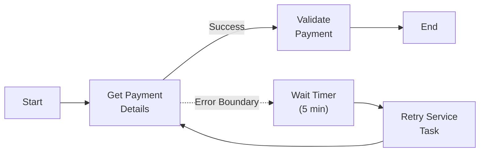
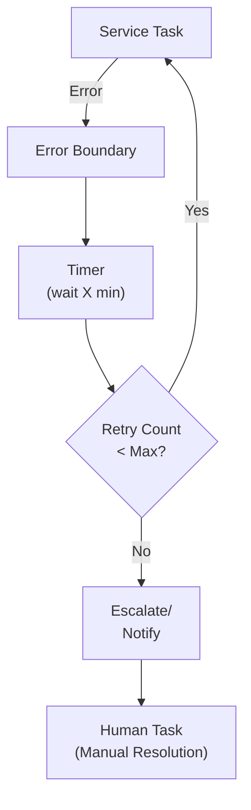
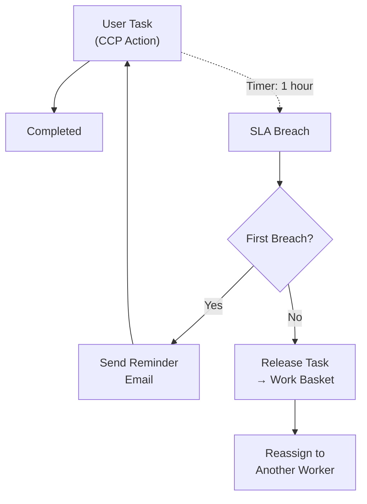
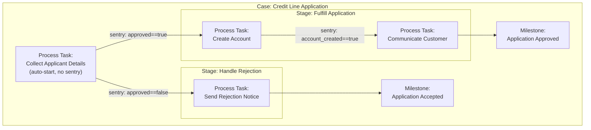
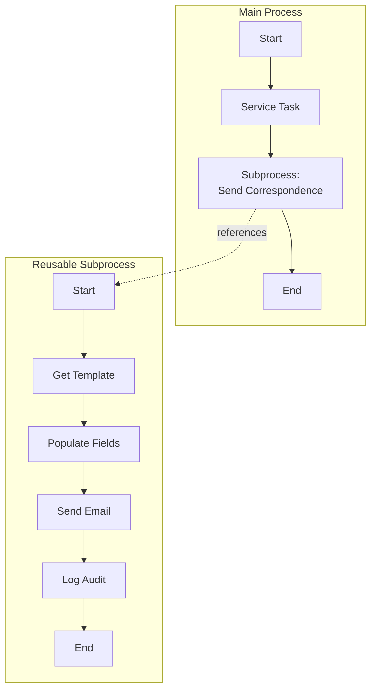
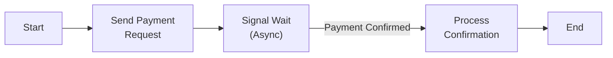
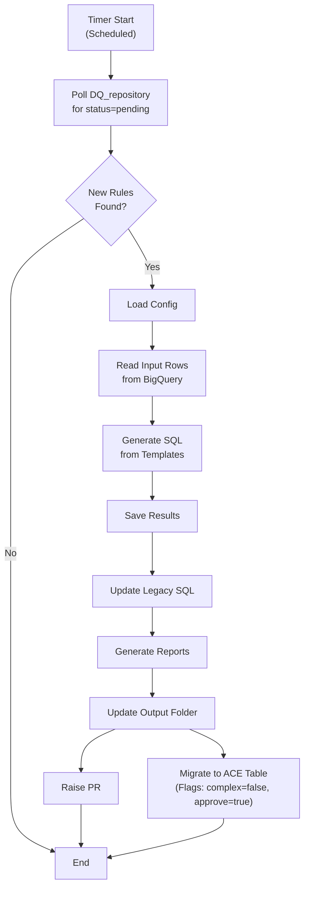
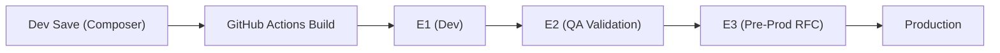

# 📘 BPMN & CMMN Tools — Comprehensive Knowledge Document

> **Source:** Synthesized from ACE Bootcamp Day 2 (BPMN/CMMN Deep Dive), Process Management Overview, Automation Naming/Versioning/Triggers, BPMN Framework Config sessions, and 20+ project implementation meetings (Jan–Jul 2026).

---

## 1. Overview

### What is BPMN?
**BPMN (Business Process Model and Notation)** is an industry-standard visual language for modeling business processes. Within ACE:
- BPMN defines **repeatable, predictable, sequential** workflows.
- Workflows are designed in **ACE Studio Composer** and executed by **ACE Engine**.
- A "process" is a business flow specifying ordered activities from start to completion.

### What is CMMN?
**CMMN (Case Management Model and Notation)** is for **semi-predictable, event-driven** workflows where:
- The sequence of activities is not fixed.
- Activities are triggered by data/event conditions (sentries).
- Cases can be long-running (30/60/90+ days).
- Parallel activities and human decisions drive the flow.

### When to Use Each

| Characteristic | BPMN (Process) | CMMN (Case) |
|---|---|---|
| **Flow type** | Directed, sequential. | Event-driven, dynamic. |
| **Predictability** | Predictable — steps are known. | Semi-predictable — depends on conditions. |
| **Duration** | Short-running. | Long-running (30/60/90 days). |
| **Automation level** | Fully automatable. | Human-centric with automated subprocesses. |
| **Execution** | All steps execute in defined order. | Not all plan items must execute. |
| **Best for** | Routine processes, batch jobs. | Disputes, fraud, applications. |

---

## 2. BPMN Shapes Reference

### 2.1 Tasks

| Shape | Type | Description | Icon |
|---|---|---|---|
| **Service Task** | Automated | Executes business logic (API calls, system integrations, data processing). | ⚙️ Gear icon |
| **User Task** | Manual | Work assigned to a human (CCP, analyst, operator). | 👤 Person icon |
| **RPA Task** | Automated | Robot Framework script executes — web, mainframe, or desktop automation. | 🤖 Robot icon |
| **Process Task** | Orchestration | Invokes another BPMN subprocess (sync or async). | ▶️ Arrow icon |

### 2.2 Events

#### Start Events

| Event | Description | Use Case |
|---|---|---|
| **Normal Start** | Process starts immediately when invoked. | API-triggered flows. |
| **Timer Start** | Process starts on a schedule (date/duration/cycle/cron). | Daily/weekly batch jobs. |
| **Signal Start** | Process starts when an external signal is received. | Waiting for payment confirmation. |

#### Intermediate Events

| Event | Description | Use Case |
|---|---|---|
| **Intermediate Catch** | Process pauses, waiting for an event. | Waiting for external input mid-flow. |
| **Signal Intermediate** | Process waits for external signal then resumes. | Async payment confirmation. |
| **Timer Intermediate** | Process waits for a specified duration. | Wait 5 min before retry. |

#### End Events

| Event | Description | Use Case |
|---|---|---|
| **Normal End** | Process completes normally. | Successful flow completion. |
| **Terminating End** | Aborts ALL parallel flows immediately. | When one branch completes, kill others. |
| **Error End** | Process ends with a specific error. | Unrecoverable business failure. |

#### Boundary Events

| Event | Attaches To | Description | Use Case |
|---|---|---|---|
| **Error Boundary** | Service Task | Catches specific errors from the task. | API failure → retry or escalate. |
| **Timer Boundary** | User Task | Fires after a timeout period. | SLA breach → send reminder. |
| **Signal Boundary** | Any Task | Fires when external signal received. | External cancellation notification. |

### 2.3 Gateways

| Gateway | Symbol | Description | Use Case |
|---|---|---|---|
| **Exclusive (XOR)** | ◇ | Routes to ONE path based on condition. | If payment_failed → manual else → end. |
| **Parallel** | ◇+ | Routes to ALL paths simultaneously. | Send email AND update DB simultaneously. |
| **Inclusive (OR)** | ◇○ | Routes to ONE or MORE paths based on conditions. | Multiple optional steps. |

### 2.4 Sequence Flows

| Type | Description |
|---|---|
| **Normal Flow** | Default path between nodes. |
| **Conditional Flow** | Flow with a condition expression (diamond on start). |
| **Default Flow** | Fallback path when no conditions match (slash mark on start). |

---

## 3. Validation & Exception Handling Patterns

### 3.1 Mandatory Validation Bundles
Per leadership guidelines, every BPMN workflow model must incorporate two standard validation bundles:
1. **Input Validation Bundle:** Validates that mandatory parameters are passed and throw business exceptions if missing.
2. **System Exception Handling Bundle:** Gracefully intercepts platform exceptions (e.g. database, network timeouts) to prevent abnormal execution termination and output diagnostic info.

### 3.2 UI Request Validation (`ValidateRequestForm`)
For processes triggered by UI inputs, a validation service class `ValidateRequestForm` is executed before service tasks:
- **Mandatory Fields Check:** Automatically parses human task input/output variables (such as Table ID, Variable ID) and asserts that they are non-empty.
- **Template-Based Branching:** The service matches UI requests containing a template number (**Templates 1 to 4**). Validation rules and constraints (e.g. allowed numeric margin values) branch based on the specified template.
- **Null Handling:** Some fields are marked as `null allowed` in the design requirements. The validator checks these explicitly to mark them valid.
- **Post-Validation flow:** On success, transitions to operations such as sending emails, which include built-in retry profiles. On validation failure, a business exception is thrown to abort the process.

### 3.3 Error Boundary Events — Deep Dive

Error boundaries are the **primary mechanism** for handling recoverable errors in BPMN flows.



#### Configuration
- Each error boundary has an **error code** and **error name**.
- Multiple boundaries per task → different errors → different recovery flows.
- **Naming convention must be standardized** across the portfolio for consistent reporting.

#### Key Rules

| Rule | Details |
|---|---|
| **One or many** | A single task can have multiple error boundaries (up to N). |
| **Error-specific** | Each boundary catches a specific named error, not all errors. |
| **Recoverable only** | Use boundaries only when there's a reasonable next action. |
| **User tasks** | Error boundaries on user tasks are **not meaningful** (users don't throw exceptions). |

### 3.4 Retry Patterns



**Recommended retry configuration:**

| Parameter | Recommendation |
|---|---|
| **Retry count** | 3-5 attempts. |
| **Backoff strategy** | Exponential (1min → 2min → 4min) or fixed. |
| **After max retries** | Escalate — email notification, create work item. |
| **Logging** | Log each retry attempt with error details for RCA. |

### 3.5 SLA Enforcement with Timer Boundaries



**Timer boundary on user tasks:**
- Initialize timer when task is created/assigned.
- On breach: send reminder, or release task back to work basket for reassignment.
- Can chain multiple timers (1hr reminder → 4hr escalation → 24hr auto-close).

---

## 4. CMMN Case Management — Deep Dive

### 4.1 CMMN Shapes

| Shape | Description |
|---|---|
| **Case Model** | The root container/definition for the entire case. |
| **Stage** | A group of tasks/processes activated by conditions. |
| **Human Task** | Manual activity assigned to a person. |
| **Process Task** | Invokes a BPMN subprocess (reference by name). |
| **Milestone** | A marker showing progress/achievement in the case lifecycle. |
| **Entry Sentry** | Condition that must be TRUE to activate a stage/task/milestone. |
| **Exit Sentry** | Condition that triggers completion/exit of a stage. |

### 4.2 Sentries (Conditions)

Sentries are **event-driven triggers** that evaluate conditions on case data:

```
PSA.CustomerVerified == true
```

| Aspect | Details |
|---|---|
| **When evaluated** | On every case data update. |
| **Language** | MVEL (Java-like syntax, simplified). |
| **Complexity** | Can be simple (1 attribute) or complex (multiple attributes, AND/OR). |
| **Result** | Evaluates to true/false → triggers associated plan item. |

#### MVEL Condition Examples

```java
// Simple boolean check
PSA.CustomerVerified == true

// Numeric comparison
application.CreditScore >= 700

// String match
status.ApplicationDecision == "APPROVED"

// Complex condition
(account.Balance > 0) && (customer.Country == "US") && (risk.Level != "HIGH")
```

### 4.3 Case Model Example — Credit Line Application



---

## 5. ACE Studio Composer — Design Workflow

### 5.1 Tool Overview
ACE Studio Composer is a **web-based** visual design tool for creating BPMN and CMMN definitions.

### 5.2 Creating a BPMN Process
1. **Create New BPMN** → Opens canvas.
2. **Add Start Event** → Drag from palette.
3. **Append Tasks** → Click task icon to auto-connect with arrow.
4. **Configure Task Type** (Service, User, RPA, Process).
5. **Add Gateways** and define condition expressions.
6. **Add Boundary Events** (Error/Timer boundaries).
7. **Add End Events** and configure input/output context variables.
8. **Save & Publish** to assets.

### 5.3 Service Catalog
- **228+ reusable tasks** available in the catalog.
- Tasks include: input parameters, output parameters, execution config.

---

## 6. Design Patterns & Best Practices

### 6.1 Subprocess Reuse Pattern


### 6.2 Async Signal Wait Pattern


---

## 7. Project-Specific BPMN Implementations

### 7.1 DQ Rule Onboarding BPMN


- **Core script:** `sql_generation_dag.py` utilizing the Airflow TaskFlow pattern.
- **SQL Consolidation:** Automatically appends `UNION DISTINCT` query blocks to table-level files rather than creating new files per check, minimizing PR merge conflicts.
- **Table Syncing:** Replicates DQ Repository records to the ACE front-end input table. Maps Use Case Names to IDs (e.g. `RESI` to `1`, `benefits` to `16`).

### 7.2 ACDV Dispute Validation Flow
The ACDV dispute handling process consists of complex validation and aggregation rules:
1. **Eligibility Check:** Evaluates account formats (empty, starts with `61`, or invalid combinations of lengths 13/16 are business-exceptioned).
2. **GCBR Retrieval:** Queries GCBR for account information and override parameters to formulate search requests.
3. **SOR Aggregation:** Retrieves account details from **Triumph** (GAR master details) and unbilled balances from **GAR**.
4. **Bankruptcy Search:** Uses the **ACON** utility to convert the account number to a secure token and fetch collector/bankruptcy flags.
5. **Special Comment Code (SCC) Filter:** Universally filters out SCC `"AH"` sold accounts (for all brands, expanding brand-specific rules for Costco/JetBlue).
6. **delinquency check:** Evaluates Dispute Codes (e.g. `111`), DOFD, and canceled status.
7. **Satisfactory Deletion Check (7-Year rule):** Compares Triumph cancellation date (`FF30`) to current date; rejects if delta > 7 years.
8. **e-OSCAR Consumer/Account Verification:** Performs validation on DOP, SSN, ECOA, credit limit, and Care enrollment. Matches against e-OSCAR data and marks fields as "changed" or "same".
9. **ACDV Response submission:** Computes response codes (01 = no change, 21/22/23 = change classifications), builds audit trail notes, and submits response to e-OSCAR.

---

## 8. BPMN Runtime Framework & Promotion

### 8.1 Runtime Framework Architecture
- The runtime framework executes published BPMN configurations.
- **BPMN is separate from DAG:** BPMN executes workflow models; DAGs (Lumi/Airflow) schedule and manage BigQuery pipelines.

### 8.2 Local Setup (IntelliJ)
1. **Java Version:** Set to **Java 21**.
2. **Main Application:** Spring Boot main class execution.
3. **Arguments and Secrets:** Add VM active profile options. *Important: Secret keys must be obtained via secure channels (Slack/Email) and never written to files.*
4. **Performance:** Run **File -> Invalidate Caches / Restart** if IntelliJ hangs.

### 8.3 Git CI/CD Promotion Process


- **E2 Success Rule:** Before requesting promotion to E3, you must execute at least one successful process instance in E2 and record the Instance ID as proof.
- **RFC Rule:** E3 deployment requests require a formal RFC submission containing validation evidence, backup plans, and approvals at least **48 hours** before the scheduled window.

---

## 9. Naming Conventions

### 9.1 Asset Naming
```
ACES_<BusinessFunction>_<major>.<minor>.<patch>
```

### 9.2 Error Standard
- `ERR_API_TIMEOUT` — Downstream API timeout.
- `ERR_DATA_INVALID` — Validation failed.
- `ERR_SYSTEM_UNAVAILABLE` — Backend unavailable.
- `BIZ_ACCOUNT_CLOSED` — Business scenario: closed account.

---

## 10. Common Pitfalls & Lessons Learned

| Pitfall | Lesson |
|---|---|
| **XCOM Memory Leaks** | Emitted data logs in Airflow compile. Always flush XCOM variables after completion. |
| **Hardcoded configurations** | Store metadata (like allowed margins/use case IDs) in database configuration tables rather than static code. |
| **Personal ADSID Decryption** | Never decrypt production PII data using personal ADSIDs (June had 62 flagged views). |
| **Scratch Tables Pollution** | Clean up temporary folders and test tables in Dev and QA post-execution. |
| **Timer Boundary on User Task** | Timer boundary triggers are highly effective for SLA monitoring, but never attach an Error Boundary to a User Task. |
| **Skip E2 Runs** | You cannot raise an RFC for E3/Production without registering a successful instance ID in E2. |
