# 📘 BPMN & CMMN Tools — Comprehensive Knowledge Document

> **Source:** Synthesized from ACE Bootcamp Day 2 (BPMN/CMMN Deep Dive), Process Management Overview, Automation Naming/Versioning/Triggers, BPMN Framework Config sessions, and project implementation meetings (Jan–Jul 2026).

---

## 1. Overview

### What is BPMN?
**BPMN (Business Process Model and Notation)** is an industry-standard visual language for modeling business processes. Within ACE:
- BPMN defines **repeatable, predictable, sequential** workflows
- Workflows are designed in **ACE Studio Composer** and executed by **ACE Engine**
- A "process" is a business flow specifying ordered activities from start to completion

### What is CMMN?
**CMMN (Case Management Model and Notation)** is for **semi-predictable, event-driven** workflows where:
- The sequence of activities is not fixed
- Activities are triggered by data/event conditions (sentries)
- Cases can be long-running (30/60/90+ days)
- Parallel activities and human decisions drive the flow

### When to Use Each

| Characteristic | BPMN (Process) | CMMN (Case) |
|---|---|---|
| **Flow type** | Directed, sequential | Event-driven, dynamic |
| **Predictability** | Predictable — steps are known | Semi-predictable — depends on conditions |
| **Duration** | Short-running | Long-running (30/60/90 days) |
| **Automation level** | Fully automatable | Human-centric with automated subprocesses |
| **Execution** | All steps execute in defined order | Not all plan items must execute |
| **Best for** | Routine processes, batch jobs | Disputes, fraud, applications |

---

## 2. BPMN Shapes Reference

### 2.1 Tasks

| Shape | Type | Description | Icon |
|---|---|---|---|
| **Service Task** | Automated | Executes business logic (API calls, system integrations, data processing) | ⚙️ Gear icon |
| **User Task** | Manual | Work assigned to a human (CCP, analyst, operator) | 👤 Person icon |
| **RPA Task** | Automated | Robot Framework script executes — web, mainframe, or desktop automation | 🤖 Robot icon |
| **Process Task** | Orchestration | Invokes another BPMN subprocess (sync or async) | ▶️ Arrow icon |

### 2.2 Events

#### Start Events

| Event | Description | Use Case |
|---|---|---|
| **Normal Start** | Process starts immediately when invoked | API-triggered flows |
| **Timer Start** | Process starts on a schedule (date/duration/cycle/cron) | Daily/weekly batch jobs |
| **Signal Start** | Process starts when an external signal is received | Waiting for payment confirmation |

#### Intermediate Events

| Event | Description | Use Case |
|---|---|---|
| **Intermediate Catch** | Process pauses, waiting for an event | Waiting for external input mid-flow |
| **Signal Intermediate** | Process waits for external signal then resumes | Async payment confirmation |
| **Timer Intermediate** | Process waits for a specified duration | Wait 5 min before retry |

#### End Events

| Event | Description | Use Case |
|---|---|---|
| **Normal End** | Process completes normally | Successful flow completion |
| **Terminating End** | Aborts ALL parallel flows immediately | When one branch completes, kill others |
| **Error End** | Process ends with a specific error | Unrecoverable business failure |

#### Boundary Events

| Event | Attaches To | Description | Use Case |
|---|---|---|---|
| **Error Boundary** | Service Task | Catches specific errors from the task | API failure → retry or escalate |
| **Timer Boundary** | User Task | Fires after a timeout period | SLA breach → send reminder |
| **Signal Boundary** | Any Task | Fires when external signal received | External cancellation notification |

### 2.3 Gateways

| Gateway | Symbol | Description | Use Case |
|---|---|---|---|
| **Exclusive (XOR)** | ◇ | Routes to ONE path based on condition | If payment_failed → manual else → end |
| **Parallel** | ◇+ | Routes to ALL paths simultaneously | Send email AND update DB simultaneously |
| **Inclusive (OR)** | ◇○ | Routes to ONE or MORE paths based on conditions | Multiple optional steps |

### 2.4 Sequence Flows

| Type | Description |
|---|---|
| **Normal Flow** | Default path between nodes |
| **Conditional Flow** | Flow with a condition expression (diamond on start) |
| **Default Flow** | Fallback path when no conditions match (slash mark on start) |

---

## 3. Error Handling Patterns

### 3.1 Error Boundary Events — Deep Dive

Error boundaries are the **primary mechanism** for handling recoverable errors in BPMN flows.

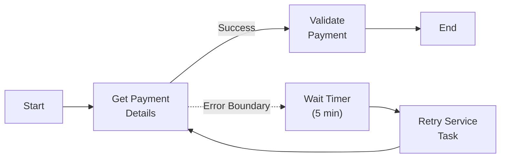

#### Configuration
- Each error boundary has an **error code** and **error name**
- Multiple boundaries per task → different errors → different recovery flows
- **Naming convention must be standardized** across the portfolio for consistent reporting

#### Key Rules

| Rule | Details |
|---|---|
| **One or many** | A single task can have multiple error boundaries (up to N) |
| **Error-specific** | Each boundary catches a specific named error, not all errors |
| **Recoverable only** | Use boundaries only when there's a reasonable next action |
| **User tasks** | Error boundaries on user tasks are **not meaningful** (users don't throw exceptions) |

### 3.2 Retry Patterns

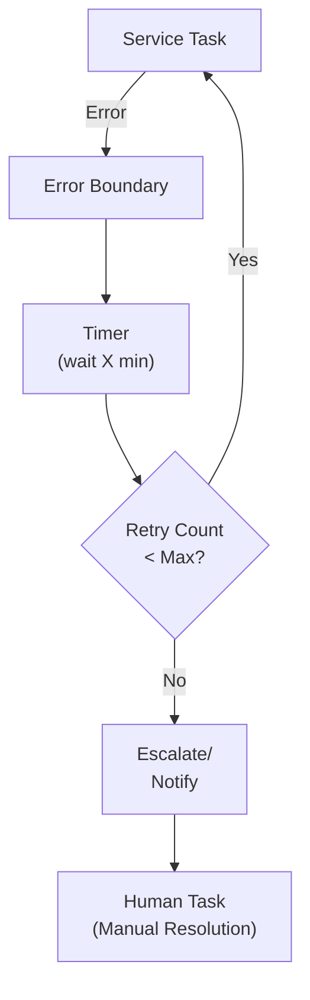

**Recommended retry configuration:**

| Parameter | Recommendation |
|---|---|
| **Retry count** | 3-5 attempts |
| **Backoff strategy** | Exponential (1min → 2min → 4min) or fixed |
| **After max retries** | Escalate — email notification, create work item |
| **Logging** | Log each retry attempt with error details for RCA |

### 3.3 SLA Enforcement with Timer Boundaries

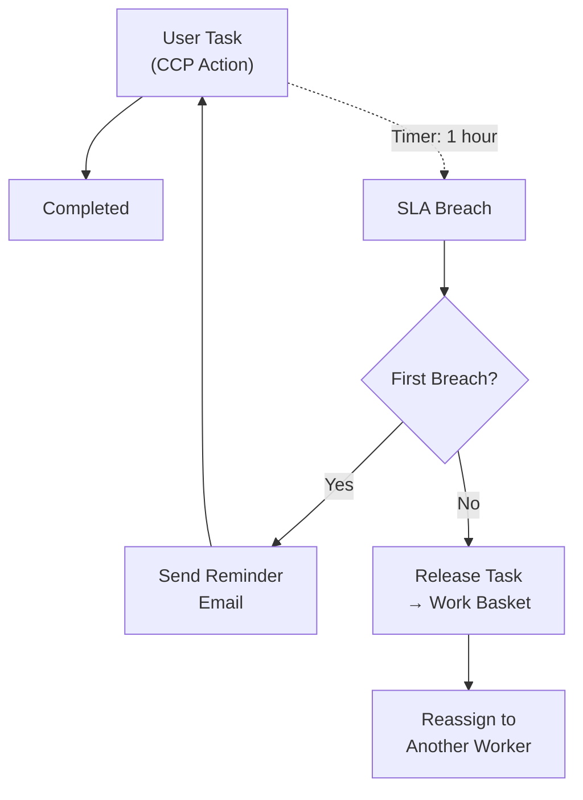

**Timer boundary on user tasks:**
- Initialize timer when task is created/assigned
- On breach: send reminder, or release task back to work basket for reassignment
- Can chain multiple timers (1hr reminder → 4hr escalation → 24hr auto-close)

---

## 4. CMMN Case Management — Deep Dive

### 4.1 CMMN Shapes

| Shape | Description |
|---|---|
| **Case Model** | The root container/definition for the entire case |
| **Stage** | A group of tasks/processes activated by conditions |
| **Human Task** | Manual activity assigned to a person |
| **Process Task** | Invokes a BPMN subprocess (reference by name) |
| **Milestone** | A marker showing progress/achievement in the case lifecycle |
| **Entry Sentry** | Condition that must be TRUE to activate a stage/task/milestone |
| **Exit Sentry** | Condition that triggers completion/exit of a stage |

### 4.2 Sentries (Conditions)

Sentries are **event-driven triggers** that evaluate conditions on case data:

```
PSA.CustomerVerified == true
```

| Aspect | Details |
|---|---|
| **When evaluated** | On every case data update |
| **Language** | MVEL (Java-like syntax, simplified) |
| **Complexity** | Can be simple (1 attribute) or complex (multiple attributes, AND/OR) |
| **Result** | Evaluates to true/false → triggers associated plan item |

#### MVEL Condition Examples

```java
// Simple boolean check
PSA.CustomerVerified == true

// Numeric comparison
application.CreditScore >= 700

// String match
status.ApplicationDecision == "APPROVED"

// Complex condition
(account.Balance > 0) && (customer.Country == "US") && (risk.Level != "HIGH")
```

### 4.3 Case Model Example — Credit Line Application

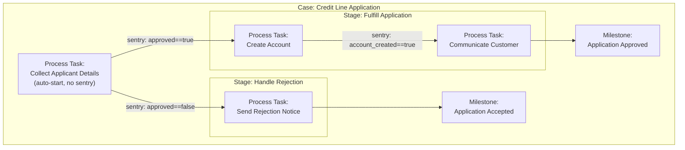

**Key behaviors:**
- `Collect Applicant Details` has **no sentry** → auto-starts when case is created
- `Handle Rejection` stage has a sentry waiting for `approved == false`
- `Fulfill Application` stage has a sentry waiting for `approved == true`
- Within Fulfill: `Communicate Customer` waits for `account_created == true`
- **Not all plan items execute** — if rejected, fulfill stage never fires
- **Milestones** track progress without affecting flow logic

### 4.4 BPMN ↔ CMMN Interplay

| Rule | Details |
|---|---|
| **Case → BPMN** | Cases CAN invoke BPMN subprocesses via process tasks |
| **BPMN → Case** | Processes CANNOT embed cases (different standards) |
| **Subprocess reference** | Process tasks reference a BPMN asset name available in the environment |
| **Reusability** | Define BPMN subprocesses once, reference from multiple cases |

---

## 5. ACE Studio Composer — Design Workflow

### 5.1 Tool Overview
ACE Studio Composer is a **web-based** visual design tool for creating BPMN and CMMN definitions.

### 5.2 Creating a BPMN Process

**Step-by-step:**
1. **Create New BPMN** → Opens canvas with palette
2. **Add Start Event** → Drag from palette or click
3. **Append Tasks** → Click task icon to auto-connect with arrow
4. **Configure Task Type:**
   - Select: Service Task, User Task, or RPA Task
   - Name the task (e.g., "Get Payment Details")
5. **Add Gateways** → For conditional branching
6. **Define Conditions** → Set gateway condition expressions
7. **Add Boundary Events** → Drag error/timer onto tasks
8. **Add End Events** → Normal or Terminating
9. **Configure Properties** → For each task: inputs, outputs, work basket assignment
10. **Save & Publish** → To assets for deployment

### 5.3 Creating a CMMN Case

**Step-by-step:**
1. **Create New CMMN** → Opens case model canvas
2. **Add Plan Items:**
   - Human Tasks (manual actions)
   - Process Tasks (reference existing BPMN)
3. **Group into Stages** → Drag to create stage containers
4. **Add Entry Sentries** → Click diamond icon on stage/task border
5. **Configure Conditions** → MVEL expressions in properties panel
6. **Add Milestones** → Track progress markers
7. **Set References** → For process tasks, specify which BPMN to invoke
8. **Save & Publish**

### 5.4 Service Catalog
- **228+ reusable tasks** available in the catalog
- Create reusable service tasks used across multiple processes
- Register RPA scripts in the catalog for cross-team reuse
- Tasks include: input parameters, output parameters, execution config

---

## 6. Design Patterns & Best Practices

### 6.1 Subprocess Reuse Pattern
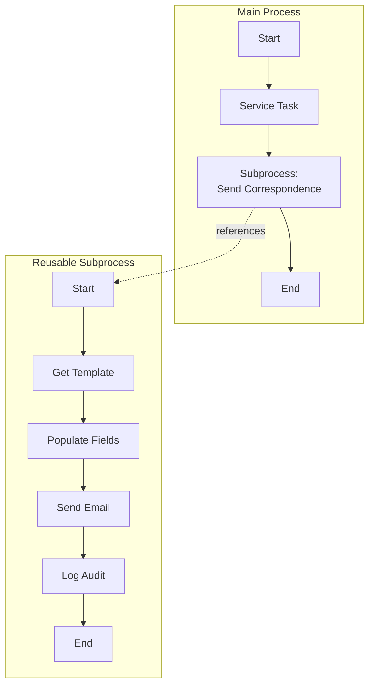

### 6.2 Human Task with SLA Pattern
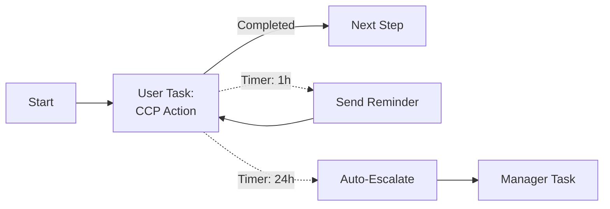

### 6.3 Parallel Processing with Gateway
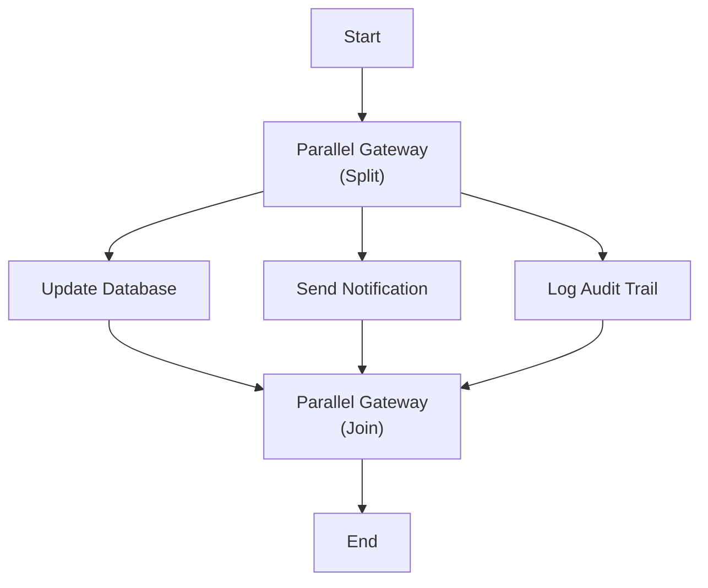

### 6.4 Async Signal Wait Pattern
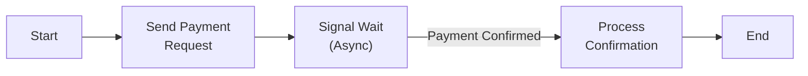

---

## 7. Project-Specific BPMN Implementations

### 7.1 DQ Rule Onboarding BPMN

The team uses BPMN for automated DQ rule onboarding:

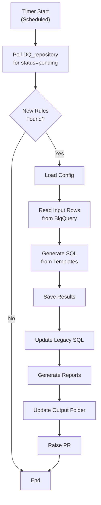

**Implementation details:**
- Entry: `sql_generation_dag.py` using Airflow taskflow pattern
- Template strategy: 4 of 5 check types templated (duplicate, missing, stagnant, valid value); threshold partially covered
- ~1,500-1,600 rules across 300-400 tables

### 7.2 Bulk Alert Update BPMN

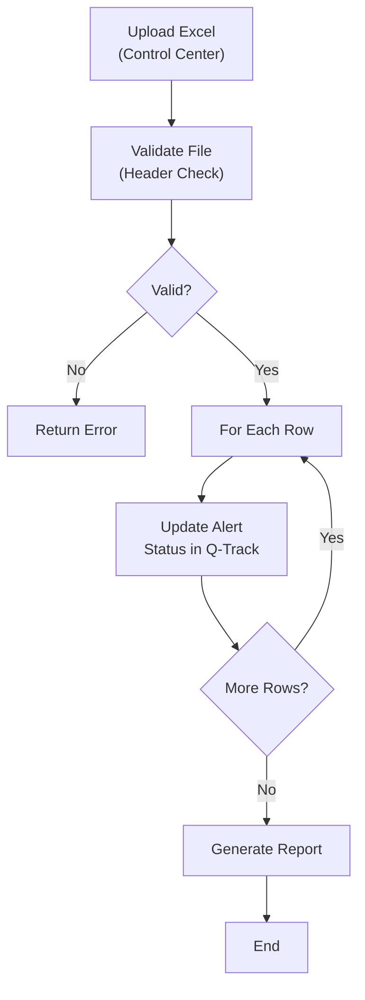

### 7.3 ACDV Dispute BPMN (Simplified)

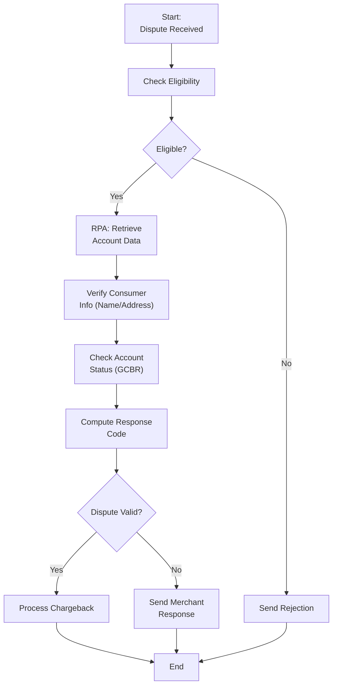

---

## 8. BPMN Runtime Framework

### 8.1 Framework Architecture
- The project maintains a **BPMN runtime framework** that executes BPMN configurations
- The codebase contains **service bundles** and **framework configuration**
- BPMN definitions are designed (in Composer) and then executed by this framework
- **BPMN is different from DAG** — team explicitly clarifies this during onboarding

### 8.2 Local Development Setup (IntelliJ)
1. Clone the framework repository (branch shared via Slack)
2. Open in IntelliJ IDEA
3. Configure run configuration:
   - Select correct Java version (Java 21)
   - Set main class (Spring Boot application)
   - Add VM options (shared securely via email/Slack)
   - Set active profile
4. Some config values are **secrets** — never committed to code
5. If IntelliJ hangs: **File → Invalidate Caches / Restart**

### 8.3 Two Composers
| Tool | Purpose |
|---|---|
| **ACE Composer** | Design BPMN/CMMN flows for ACE Engine |
| **Lumi Composer** | Design DT (Data Transformation) flows for Lumi pipeline |

---

## 9. Naming Conventions for BPMN Assets

### 9.1 Process Naming
```
ACES_<BusinessFunction>_<major>.<minor>.<patch>
```

**Examples:**
- `ACES_FraudDispute_1.0.0`
- `ACES_PaymentProcessing_2.1.0`
- `ACES_KYCRefresh_1.0.3`

### 9.2 Error Naming
Standardized error names across all BPMNs enable portfolio-level reporting:
- `ERR_API_TIMEOUT` — downstream API timeout
- `ERR_DATA_INVALID` — input data validation failure
- `ERR_SYSTEM_UNAVAILABLE` — external system down
- `BIZ_ACCOUNT_CLOSED` — business exception, account already closed

### 9.3 Versioning Rules
| Change | Version | Example |
|---|---|---|
| Breaking change | **Major** | 1.0.0 → 2.0.0 |
| New feature, backward-compatible | **Minor** | 1.0.0 → 1.1.0 |
| Bug fix | **Patch** | 1.0.0 → 1.0.1 |

---

## 10. Key Technical Details

### 10.1 Process Context (State)
- Every process/case carries **context** — data attributes that flow through the lifecycle
- Context is initialized with input data at process start
- Tasks can read and update context
- Sentries (CMMN) evaluate context attributes

### 10.2 Correlation Keys
- Unique business identifier for tracking process instances
- Used to search/filter instances in Control Center
- Example: Order ID, Dispute ID, Account Number

### 10.3 Work Basket Configuration
- Define work baskets per team/function
- Assign user tasks to specific work baskets
- Control who can pick up work (security configuration)
- Filter tasks by lifecycle state (Ready, Reserved, In Progress)

### 10.4 Signal vs Timer vs Error

| Mechanism | Trigger | Direction | Use |
|---|---|---|---|
| **Signal** | External notification | Outside → Process | Async confirmations |
| **Timer** | Clock/duration | Internal | SLA, retry delays |
| **Error** | Task failure | Internal | Exception handling |

---

## 11. Common Pitfalls & Lessons Learned

> Based on project meetings and deployment incidents:

| Pitfall | Lesson |
|---|---|
| **Missing error boundaries** | Always add error handling — unhandled errors terminate process abnormally |
| **No retry logic** | Downstream APIs fail intermittently; add 3-retry with backoff |
| **XCOM variable leak** | Always clean up XCOM variables after process completion |
| **Naming inconsistency** | Standardize error names across all BPMNs for reporting |
| **Manual Composer uploads** | Never manually upload to Composer storage; use CI/CD via deploy-config |
| **E2 testing skipped** | Must run at least 1 instance in E2 and record instance ID before RFC |
| **Large monolithic JSON** | Don't store all config in one JSON file; causes PR merge conflicts |
| **Resource initialization** | Don't initialize BigQuery/DB connections before validation checks |
| **Terminating vs Normal end** | Use Terminating End only when you want to abort all parallel flows |

---

## 12. Quick Reference: Supported BPMN/CMMN Shapes in ACE

### BPMN

| Category | Shapes Supported |
|---|---|
| **Tasks** | Service, User/Human, RPA, Process (subprocess) |
| **Start Events** | Normal, Timer, Signal |
| **Intermediate Events** | Timer, Signal, Message (catch) |
| **Boundary Events** | Error, Timer, Signal |
| **End Events** | Normal, Terminating, Error |
| **Gateways** | Exclusive (XOR), Parallel, Inclusive (OR) |
| **Flows** | Normal, Conditional, Default sequence flow |

### CMMN

| Category | Shapes Supported |
|---|---|
| **Containers** | Case Model, Stage |
| **Tasks** | Human Task, Process Task |
| **Markers** | Milestone |
| **Conditions** | Entry Sentry, Exit Sentry |
| **Language** | MVEL for condition expressions |

> **Note:** ACE supports a **subset** of the full BPMN/CMMN specs. The subset covers all enterprise needs. If gaps are found, ACE engineering can add support since they built the platform.

---

## 13. Glossary

| Term | Definition |
|---|---|
| **ACE** | Automation and Case Ecosystem |
| **BPMN** | Business Process Model and Notation |
| **CMMN** | Case Management Model and Notation |
| **CCP** | Customer Care Professional (human operator) |
| **Sentry** | Event-driven condition trigger in CMMN |
| **MVEL** | Expression language for CMMN conditions |
| **Work Basket** | Queue for human tasks |
| **Deployment ID** | Logical name for infrastructure grouping |
| **RuleAssist** | ACE's Drools-based business rules engine |
| **Mod** | Reusable component registered in Mod Shop |
| **CRD** | Custom Resource Definition (input/output schema) |
| **OASIS** | Open standard for human task lifecycle |
| **Robot Framework** | Python-based RPA scripting language |
| **Process Task** | A task that invokes another BPMN subprocess |
| **Correlation Key** | Business ID for tracking process instances |
| **EDPP** | Enterprise Data Protection & Privacy |
